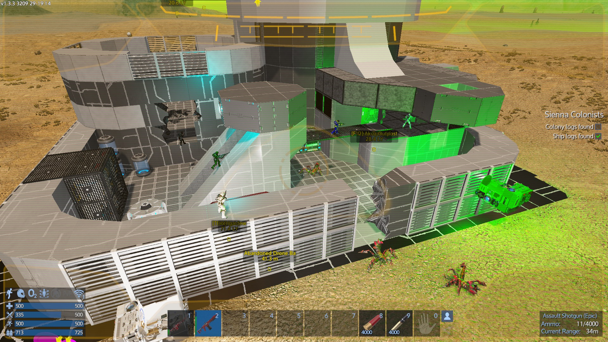
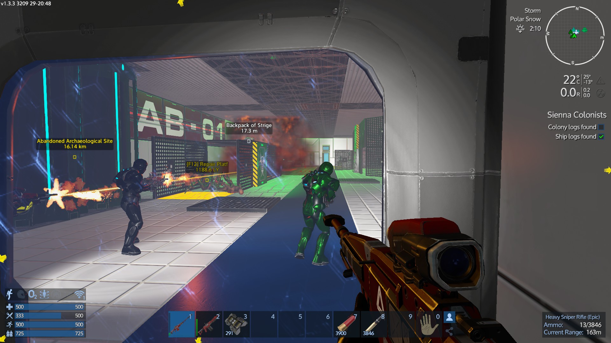
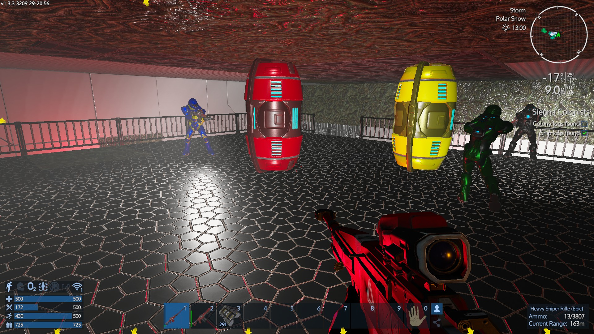
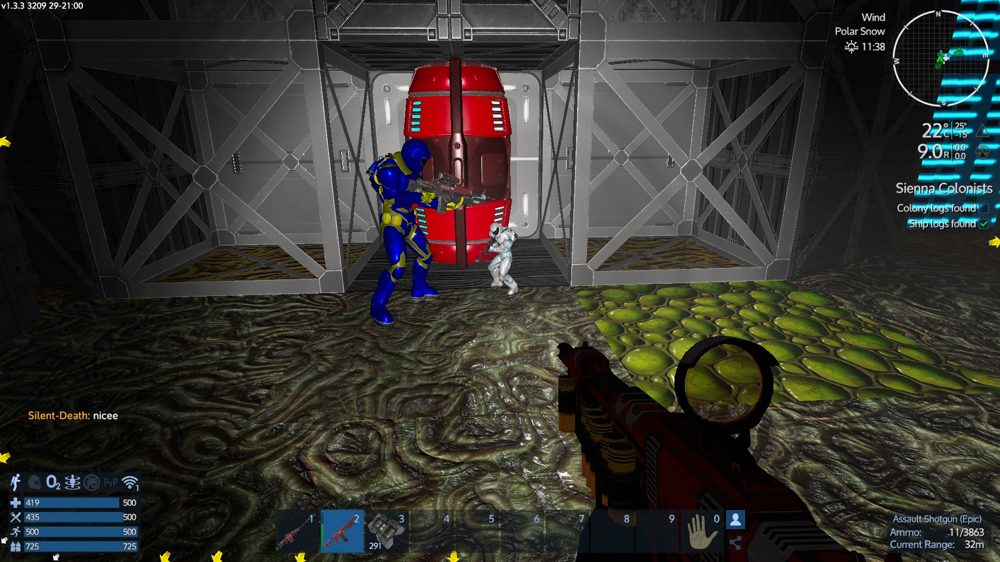

# Event: Legacy POI Base Raid

Details:

* **When:** Tuesday 29th of December, 20:00 CET (Norwegian time)
* **Requirements:** That you want to join

**This event has concluded**

---

I chose Tuesday evening as this is after the reset. Hopefully nobody raids those bases I pick before we get to them, but we will deal with that as we go along.

This event will be hosted by me, Cabbot. I will provide a CV that we can use to ferry people around to the various POIs. I will find a few POIs lined up that we can
visit.

If needs be I (or the admins and me) will provide SVs for use during the event, but I think we should just try a base raid now that is on foot. I will planets that are safe to run around on, so that when people die and spawn nearby the base, they can run to the base without much problems. We will deal with problems as they come along.

You can bring your own gear, and get to the POIs yourself, if you want to, but you don't have to.

Everyone that wants to will get weapons and some gear. You can of course bring your own if you want to but I thought it'd be easier if there are completely fresh people that want to join if there were no requirements at all:

* Light armor and EVA boost
* T2 shotgun and ammo
* T2 sniper and ammo
* Some bandages and other healing items, and some food

Everything you get is free to keep after the event if you want.

During the base raids we should try to dole out epic loot in a round-robin fashion. Everything else is up for grabs but please share if someone needs specific things.

I do not have complete knowledge of all the POIs so we will in some cases probably go in blind, which is part of the fun :)

I can pick up anyone that wants to join, wherever they are (within reason, don't travel to the Legacy homeworld first please :))

If you have questions, ask me in-game, or send me an email to lasse@vkarlsen.no, I'm also on Discord most of the time.